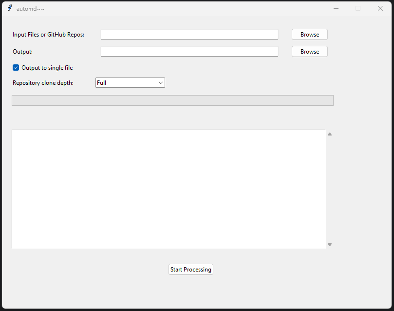

# ~auto~md~

~auto~md~ is a mini python based tool designed to convert various types of files and GitHub repositories into LLM-ready Markdown documents

## Features

- **Supports Multiple File Types**: Processes `.txt`, `.md`, `.html`, `.css`, `.py`, `.js`, `.yaml`, `.yml`, `.json`, `.xml`, `.csv`, `.rst`, `.ini`, `.cfg`, `.log`, `.conf` files
- **Handles Zip Files**: Automatically extracts and processes nested zip files
- **GitHub Integration**: Clones and processes GitHub repositories
- **Auto-Generated Output Filename**: Automatically sets the output file name based on the input file or repository
- **AI-Optimized Markdown**: Generates Markdown with metadata, a table of contents, and consistent heading styles

