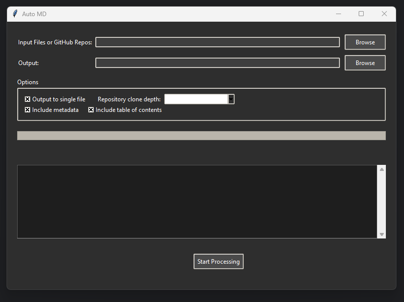

# ~auto~md~

### Python tool that converts various file types and GitHub repositories into Markdown documents (.md) optimized for quick RAG/indexing via large language models (LLMs)



## Features

- Supports multiple file types (see table below)
- Processes zip files/folders/individual files and GitHub repositories
- Generates a single Markdown file or multiple files
- Creates a table of contents and metadata for each file processed

## Supported File Extensions

| Category | Extensions |
|----------|------------|
| Text | .txt, .text, .log |
| Markdown | .md, .markdown, .mdown, .mkdn, .mkd, .mdwn, .mdtxt, .mdtext |
| Web | .html, .htm, .xhtml, .shtml, .css, .scss, .sass, .less |
| Programming | .py, .pyw, .js, .jsx, .ts, .tsx, .java, .c, .cpp, .cs, .go, .rb, .php, .swift, .kt |
| Data | .json, .jsonl, .yaml, .yml, .xml, .csv, .tsv |
| Config | .ini, .cfg, .conf, .config, .toml, .editorconfig |
| Shell | .sh, .bash, .zsh, .fish, .bat, .cmd, .ps1 |
| Other | .rst, .tex, .sql, .r, .lua, .pl, .scala, .clj, .ex, .hs, .ml, .rs, .vim |

## Quick Setup Guide

1. Install Python 3.7 or newer

2. Download this project (or clone repo like normal):
   - Click the green "Code" button above
   - Choose "Download ZIP"
   - Extract the ZIP file

3. Open a terminal/command prompt and navigate to the extracted folder:
   ```
   cd path/to/Auto-MD
   ```

4. Install required packages:
   ```
   pip install -r requirements.txt
   ```

5. Run the application:
   ```
   python main.py
   ```

6. Use the GUI to:
   - Select input files/folders
   - Choose output location
   - Set processing options
   - Click "Start Processing"

## Example Input/Output

### Input

Let's say you have the following files in a folder called "my_project":

- README.md
- script.py
- data.json
- styles.css

### Output

After processing with Auto MD, you would get a single Markdown file (`output.md`) that looks like the example below

This single .md file contains all the content from your input files, with a table of contents at the top for easy navigation and referencing / indexing via LLM models

```markdown
# Auto MD Output

## Table of Contents
- [README](#readme)
- [script](#script)
- [data](#data)
- [styles](#styles)

---

# README

## Metadata
- **Generated on:** 2024-06-30 16:30:15
- **Source:** my_project

(Content of README.md)

---

# script

## Metadata
- **Generated on:** 2024-06-30 16:30:16
- **Source:** my_project

(Content of script.py)

---

# data

## Metadata
- **Generated on:** 2024-06-30 16:30:17
- **Source:** my_project

(Content of data.json)

---

# styles

## Metadata
- **Generated on:** 2024-06-30 16:30:18
- **Source:** my_project

(Content of styles.css)
```

## Terminal

To use Auto MD from the command line, run the following command:

```bash
python terminal.py [options]
```

### Options

- `-i`, `--input`: Input file(s) or folder(s) (required)
- `-o`, `--output`: Output file or folder (required)
- `-s`, `--single-file`: Combine all input files into a single output file (default: False)
- `-r`, `--repo-depth`: Depth for GitHub repository cloning (default: None)
- `-m`, `--include-metadata`: Include metadata in output (default: True)
- `-t`, `--include-toc`: Include table of contents in output (default: True)
- `-v`, `--verbose`: Enable verbose output (default: False)
- `-g`, `--gitignore`: Path to a .gitignore file to use for excluding files (default: None)
- `-x`, `--ignore-paths`: Comma-separated list of paths to ignore (default: None)

### Examples

1. Process a single text file and save the output to a single Markdown file:

```bash
python terminal.py -i input.txt -o output.md -s
```

2. Process a folder and save each file as a separate Markdown file:

```bash
python terminal.py -i input_folder -o output_folder
```

3. Process a GitHub repository and save the output to a single Markdown file, excluding files listed in a .gitignore file:

```bash
python terminal.py -i https://github.com/user/repo.git -o output.md -s -ig /path/to/.gitignore
```

4. Ignore some paths

```bash
python terminal.py -i input_folder -o output_folder -ip docs tests
```

This will not include the `docs` and `tests` path in the processing

